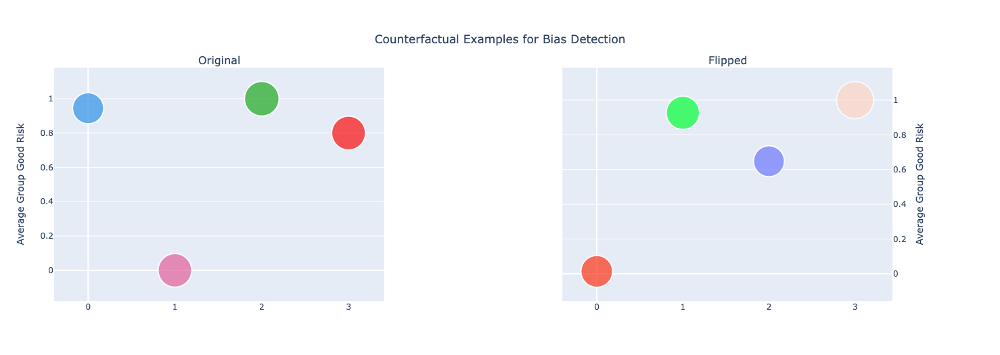

# XAI--Counterfactual-Explanation

**Goal**: Revealing NN bias and decision making process to non-expert through counterfactual examples.

**Approach**: CEB as visualisation framework

- Visualising activation patterns of NN to increase the interpretability (Clustering)
- Using counterfactual example to facilitate the discovery of biases in algorithm.

**Dataset**: Loan application which already surfers from sampling bias

### Requirements
- tensorflow >r2.2
- Python 3.
- scikit-learn
- mathplotlib
- plotly

